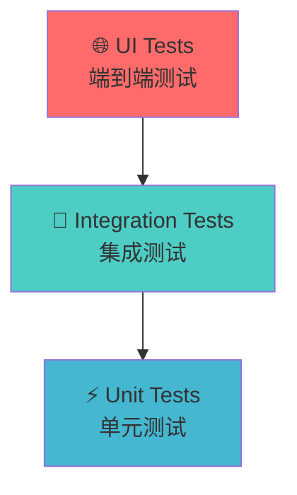
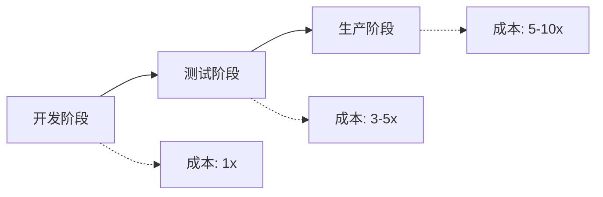
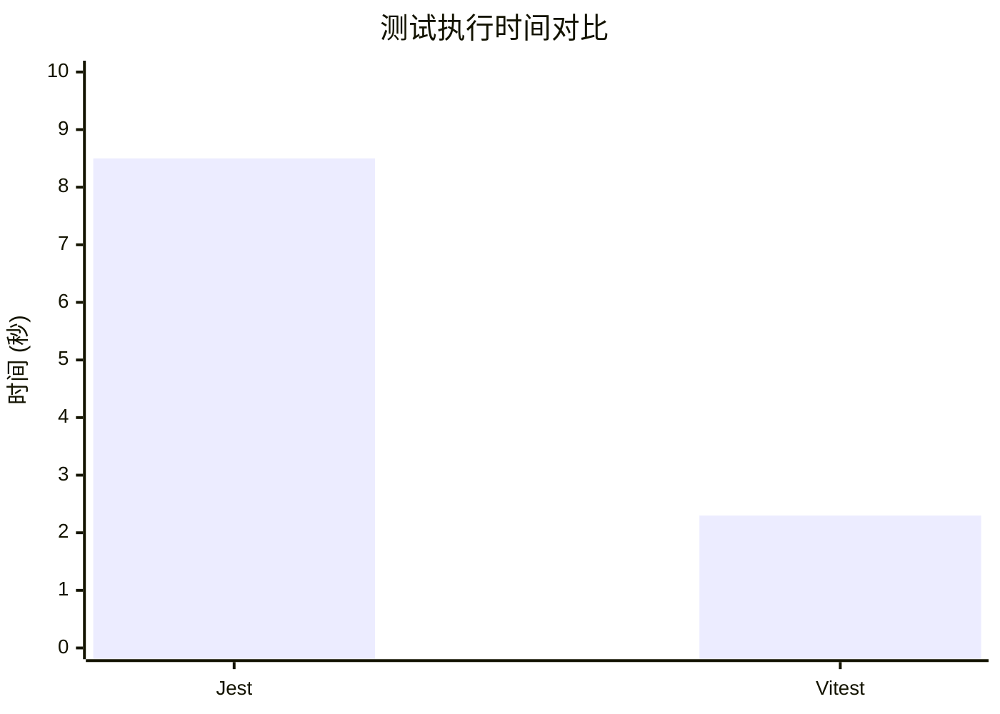

# React + Vitest 单元测试实践

从基础概念到实际应用的完整指南

<div class="pt-12">
  <span @click="$slidev.nav.next" class="px-2 py-1 rounded cursor-pointer" hover="bg-white bg-opacity-10">
    开始学习之旅 <carbon:arrow-right class="inline"/>
  </span>
</div>

<div class="abs-br m-6 flex gap-2">
  <button @click="$slidev.nav.openInEditor()" title="Open in Editor" class="text-xl slidev-icon-btn opacity-50 !border-none !hover:text-white">
    <carbon:edit />
  </button>
  <a href="https://vitest.dev" target="_blank" alt="Vitest" title="Vitest"
    class="text-xl slidev-icon-btn opacity-50 !border-none !hover:text-white">
  </a>
</div>

---
transition: fade-out
---

# 课程大纲

<div class="grid grid-cols-1 gap-4 pt-4 -mb-6">

<div v-click class="flex items-center p-4 bg-blue-50 dark:bg-blue-900/20 rounded-lg">
  <div class="text-3xl mr-4">🎯</div>
  <div>
    <h3 class="font-bold text-lg">第一部分：Unit Test 基础</h3>
    <p class="text-sm opacity-70">什么是单元测试？为什么需要单元测试？</p>
  </div>
</div>

<div v-click class="flex items-center p-4 bg-green-50 dark:bg-green-900/20 rounded-lg">
  <div class="text-3xl mr-4">⚡</div>
  <div>
    <h3 class="font-bold text-lg">第二部分：Vitest 介绍</h3>
    <p class="text-sm opacity-70">现代化的测试框架，快速且强大</p>
  </div>
</div>

<div v-click class="flex items-center p-4 bg-purple-50 dark:bg-purple-900/20 rounded-lg">
  <div class="text-3xl mr-4">🚀</div>
  <div>
    <h3 class="font-bold text-lg">第三部分：实战演练</h3>
    <p class="text-sm opacity-70">从简单到复杂，循序渐进的实例</p>
  </div>
</div>

</div>

---
layout: section
class: text-center
---

# 第一部分
## Unit Test 基础概念

---

# 什么是单元测试？

<div class="grid grid-cols-2 gap-8 pt-4">

<div>

## 定义

<v-click>

**单元测试**是对软件中的最小可测试单元进行检查和验证的测试方法。

</v-click>

<v-click>

## 特点

- 🎯 **独立性** - 每个测试独立运行
- ⚡ **快速** - 执行速度快
- 🔄 **可重复** - 结果一致可靠
- 📝 **自动化** - 可自动执行

</v-click>

</div>

<div v-click>

## 测试金字塔



<div class="text-sm pt-2 opacity-70">
单元测试是测试金字塔的基础，数量最多，成本最低
</div>

</div>

</div>

---

# 为什么需要单元测试？

<div class="grid grid-cols-2 gap-8 pt-4">

<div>

## 🛡️ 质量保障

<v-click>

- **及早发现bug** - 在开发阶段就发现问题
- **回归测试** - 确保修改不会破坏现有功能
- **代码质量** - 促使编写更好的代码

</v-click>

<v-click>

## 📚 文档作用

- **活文档** - 测试即文档，展示代码如何使用
- **规格说明** - 明确功能的预期行为

</v-click>

</div>

<div>

## 🔧 开发效率

<v-click>

- **重构信心** - 安全地重构代码
- **快速反馈** - 立即知道代码是否正常工作
- **调试辅助** - 帮助定位问题

</v-click>

<v-click>

## 💰 成本效益



</v-click>

</div>

</div>

---

# 单元测试的基本结构

## AAA 模式

<div class="grid grid-cols-3 gap-4 pt-4">

<div v-click class="p-4 bg-blue-50 dark:bg-blue-900/20 rounded-lg">
<h3 class="font-bold text-center text-blue-600 dark:text-blue-400">Arrange</h3>
<p class="text-sm text-center">准备阶段</p>
<ul class="text-xs mt-2">
  <li>• 准备测试数据</li>
  <li>• 设置测试环境</li>
  <li>• 创建测试对象</li>
</ul>
</div>

<div v-click class="p-4 bg-green-50 dark:bg-green-900/20 rounded-lg">
<h3 class="font-bold text-center text-green-600 dark:text-green-400">Act</h3>
<p class="text-sm text-center">执行阶段</p>
<ul class="text-xs mt-2">
  <li>• 调用被测试的方法</li>
  <li>• 触发要测试的行为</li>
  <li>• 获取执行结果</li>
</ul>
</div>

<div v-click class="p-4 bg-purple-50 dark:bg-purple-900/20 rounded-lg">
<h3 class="font-bold text-center text-purple-600 dark:text-purple-400">Assert</h3>
<p class="text-sm text-center">断言阶段</p>
<ul class="text-xs mt-2">
  <li>• 验证执行结果</li>
  <li>• 检查状态变化</li>
  <li>• 确认预期行为</li>
</ul>
</div>

</div>

<div v-click class="mt-6">

```javascript
test('should add two numbers correctly', () => {
  // Arrange - 准备测试数据
  const a = 2, b = 3;
  
  // Act - 执行被测试的功能
  const result = add(a, b);
  
  // Assert - 验证结果
  expect(result).toBe(5);
});
```

</div>

---
layout: section
class: text-center
---

# 第二部分
## Vitest 介绍

---

# 什么是 Vitest？

<div class="grid grid-cols-2 gap-8 pt-4">

<div>

## 🚀 现代化测试框架

<v-click>

Vitest 是一个由 **Vite** 提供支持的极速单元测试框架

</v-click>

<v-click>

## 核心特性

- ⚡ **极速** - 基于 Vite，开箱即用的 ESM、TypeScript 和 JSX 支持
- 🔧 **零配置** - 智能默认配置，即装即用
- 🎯 **Jest 兼容** - 熟悉的 API，轻松迁移
- 🔍 **智能监听** - 只运行相关的测试

</v-click>

</div>

<div v-click>

## 与其他测试框架对比

| 特性 | Vitest | Jest | 
|------|---------|------|
| 启动速度 | ⚡ 极快 | 🐌 较慢 |
| ESM 支持 | ✅ 原生 | ⚠️ 实验性 |
| TypeScript | ✅ 零配置 | 🔧 需配置 |
| Watch 模式 | ⚡ 智能 | 🔄 基础 |
| 配置复杂度 | 📦 简单 | 🔧 复杂 |

</div>

</div>

---

# DOM 环境：happy-dom vs jsdom

<div class="grid grid-cols-2 gap-8 pt-8">

<div>

## 🚀 happy-dom 优势

<v-click>

- **启动速度**: 45ms vs 333ms (快 7+ 倍)
- **HTML 解析**: 26ms vs 256ms (快 10+ 倍)
- **现代 API**: 更好的 ES6+ 和现代 Web API 支持
- **维护性**: 活跃开发，定期更新

</v-click>

</div>

<div>

## 🔄 迁移简单

<v-click>

```typescript
// 只需更改一行配置
export default defineConfig({
  test: {
-   environment: 'jsdom',
+   environment: 'happy-dom',
    globals: true,
  }
})
```

<div class="text-sm pt-1 opacity-70">
所有现有测试代码无需修改，完全兼容！
</div>

</v-click>

</div>

</div>

---

# Vitest 的优势

<div class="grid grid-cols-2 gap-8 pt-4">

<div>

## 🎯 开发体验

<v-click>

- **热重载** - 文件变化时自动重新运行测试
- **并行执行** - 充分利用多核 CPU
- **错误提示** - 清晰的错误信息和堆栈跟踪
- **调试友好** - 与 IDE 完美集成

</v-click>

<v-click>

## 📦 生态系统

- **Vite 集成** - 共享配置和插件
- **Vue/React 支持** - 开箱即用的组件测试
- **丰富插件** - 活跃的插件生态系统

</v-click>

</div>

<div>

## ⚡ 性能对比

<v-click>



</v-click>

<v-click>

## 🔧 配置简单

```typescript
// vitest.config.ts
export default defineConfig({
  test: {
    environment: 'happy-dom', // 浏览器环境
    globals: true,        // 全局测试 API
  }
})
```

</v-click>

</div>

</div>

---

# Vitest 基本 API

<div class="grid grid-cols-2 gap-8 pt-4">

<div>

## 测试函数

<v-click>

```javascript
// 基本测试
test('basic test', () => {
  expect(1 + 1).toBe(2);
});

// 描述块
describe('Calculator', () => {
  test('should add', () => {
    expect(add(2, 3)).toBe(5);
  });
});
```

</v-click>

<v-click>

## 生命周期钩子

```javascript
describe('User Service', () => {
  beforeEach(() => {
    // 每个测试前执行
  });
  
  afterEach(() => {
    // 每个测试后执行
  });
});
```

</v-click>

</div>

<div>

## 断言方法

<v-click>

```javascript
// 基本断言
expect(value).toBe(expected);
expect(value).toEqual(expected);
expect(value).toBeTruthy();
expect(value).toBeFalsy();

// 数组和对象
expect(array).toContain(item);
expect(object).toHaveProperty('key');

// 异常测试
expect(() => {
  throw new Error('error');
}).toThrow('error');
```

</v-click>

<v-click>

## 异步测试

```javascript
// Promise
test('async test', async () => {
  const result = await fetchData();
  expect(result).toBe('data');
});
```

</v-click>

</div>

</div>

---
layout: section
class: text-center
---

# 第三部分
## 实战演练：从简单到复杂

---

# 环境准备

## 安装和配置

<div class="grid grid-cols-2 gap-8 pt-4">

<div>

## 📦 安装依赖

<v-click>

```bash
# 安装 Vitest 和相关依赖
npm install -D vitest @vitest/ui

# React 测试工具
npm install -D @testing-library/react @testing-library/jest-dom happy-dom
```

</v-click>

## ⚙️ 配置文件

<v-click>

```typescript
// vitest.config.ts
import { defineConfig } from 'vitest/config'

export default defineConfig({
  test: {
    environment: 'happy-dom',
    globals: true,
    setupFiles: './src/test/setup.ts'
  }
})
```

</v-click>

</div>

<div>

## 🔧 测试环境设置

<v-click>

```typescript
// src/test/setup.ts
import '@testing-library/jest-dom'
```

</v-click>

<v-click>

## 📝 Package.json 脚本

```json
{
  "scripts": {
    "test": "vitest",
    "test:ui": "vitest --ui",
    "test:coverage": "vitest --coverage"
  }
}
```

</v-click>

<v-click>

## 🚀 运行测试

```bash
npm test        # 运行测试
npm run test:ui # 可视化界面
```

</v-click>

</div>

</div>

---

# 示例1：基本测试使用

## 测试简单的数学函数

<div class="grid grid-cols-2 gap-4 pt-4">

<div>

**被测试的函数**

```typescript
// src/utils/math.ts
export const add = (a: number, b: number): number => {
  return a + b;
};

export const multiply = (a: number, b: number): number => {
  return a * b;
};

export const divide = (a: number, b: number): number => {
  if (b === 0) {
    throw new Error('Division by zero');
  }
  return a / b;
};
```

</div>

<div>

**测试代码**

```typescript
// src/utils/__tests__/math.test.ts
import { describe, test, expect } from 'vitest'
import { add, multiply, divide } from '../math'

describe('Math Functions', () => {
  test('should add two numbers correctly', () => {
    expect(add(2, 3)).toBe(5);
    expect(add(-1, 1)).toBe(0);
    expect(add(0, 0)).toBe(0);
  });

  test('should multiply two numbers correctly', () => {
    expect(multiply(2, 3)).toBe(6);
    expect(multiply(-2, 3)).toBe(-6);
    expect(multiply(0, 5)).toBe(0);
  });

  test('should divide two numbers correctly', () => {
    expect(divide(6, 2)).toBe(3);
    expect(divide(5, 2)).toBe(2.5);
    expect(divide(-6, 2)).toBe(-3);
  });

  test('should throw error when dividing by zero', () => {
    expect(() => divide(5, 0)).toThrow('Division by zero');
  });
});
```

</div>

</div>

---

# 示例2：测试自定义Hook

## 复杂业务逻辑测试

<div class="grid grid-cols-2 gap-4 pt-4">

<div>

**自定义Hook**

```tsx
// src/hooks/useCounter.ts
import { useState, useCallback } from 'react';

export interface UseCounterReturn {
  count: number;
  increment: () => void;
  decrement: () => void;
  reset: () => void;
  setCount: (value: number) => void;
}

export const useCounter = (
  initialValue: number = 0
): UseCounterReturn => {
  const [count, setCount] = useState(initialValue);

  const increment = useCallback(() => {
    setCount(prev => prev + 1);
  }, []);

  const decrement = useCallback(() => {
    setCount(prev => prev - 1);
  }, []);

  const reset = useCallback(() => {
    setCount(initialValue);
  }, [initialValue]);

  return {
    count,
    increment,
    decrement,
    reset,
    setCount
  };
};
```

</div>

<div>

**Hook 测试**

```tsx
// src/hooks/__tests__/useCounter.test.ts
import { describe, test, expect } from 'vitest'
import { renderHook, act } from '@testing-library/react'
import { useCounter } from '../useCounter'

describe('useCounter Hook', () => {
  test('initializes with default value', () => {
    const { result } = renderHook(() => useCounter());
    
    expect(result.current.count).toBe(0);
  });

  test('initializes with custom value', () => {
    const { result } = renderHook(() => useCounter(10));
    
    expect(result.current.count).toBe(10);
  });

  test('increments count', () => {
    const { result } = renderHook(() => useCounter(0));
    
    act(() => {
      result.current.increment();
    });
    
    expect(result.current.count).toBe(1);
  });

  test('decrements count', () => {
    const { result } = renderHook(() => useCounter(5));
    
    act(() => {
      result.current.decrement();
    });
    
    expect(result.current.count).toBe(4);
  });

  test('resets to initial value', () => {
    const { result } = renderHook(() => useCounter(3));
    
    act(() => {
      result.current.increment();
      result.current.increment();
    });
    
    expect(result.current.count).toBe(5);
    
    act(() => {
      result.current.reset();
    });
    
    expect(result.current.count).toBe(3);
  });
});
```

</div>

</div>

---

# 示例3：完整 Todo 应用测试

## 测试整个应用的用户流程

<div class="grid grid-cols-2 gap-4 pt-4">

<div>

**完整的 Todo 应用**

```tsx
// src/components/TodoApp.tsx
export const TodoApp: React.FC = () => {
  const [todos, setTodos] = useState<Todo[]>([]);
  const [filter, setFilter] = useState<'all' | 'active' | 'completed'>('all');

  const addTodo = useCallback((text: string) => {
    const newTodo: Todo = {
      id: Date.now().toString(),
      text,
      completed: false
    };
    setTodos(prev => [...prev, newTodo]);
  }, []);

  const toggleTodo = useCallback((id: string) => {
    setTodos(prev => 
      prev.map(todo => 
        todo.id === id 
          ? { ...todo, completed: !todo.completed }
          : todo
      )
    );
  }, []);

  const deleteTodo = useCallback((id: string) => {
    setTodos(prev => prev.filter(todo => todo.id !== id));
  }, []);

  const clearCompleted = useCallback(() => {
    setTodos(prev => prev.filter(todo => !todo.completed));
  }, []);

  return (
    <div className="max-w-md mx-auto p-6 bg-gray-50">
      <h1 className="text-2xl font-bold text-center mb-6">
        📝 Todo 应用
      </h1>
      
      <TodoInput onAdd={addTodo} />
      
      <TodoList
        todos={todos}
        onToggle={toggleTodo}
        onDelete={deleteTodo}
        filter={filter}
      />
      
      {todos.length > 0 && (
        <div className="mt-6 pt-4 border-t">
          <div className="flex items-center justify-between">
            <span>{activeCount} 项待完成</span>
            
            <div className="flex gap-2">
              <button onClick={() => setFilter('all')}>全部</button>
              <button onClick={() => setFilter('active')}>进行中</button>
              <button onClick={() => setFilter('completed')}>已完成</button>
            </div>
            
            {completedCount > 0 && (
              <button onClick={clearCompleted}>清除已完成</button>
            )}
          </div>
        </div>
      )}
    </div>
  );
};
```

</div>

<div>

**集成测试**

```tsx
// src/components/__tests__/TodoApp.test.tsx
import { describe, test, expect } from 'vitest'
import { render, screen } from '@testing-library/react'
import userEvent from '@testing-library/user-event'
import { TodoApp } from '../TodoApp'

describe('TodoApp Integration Tests', () => {
  test('adds new todo when form is submitted', async () => {
    const user = userEvent.setup();
    render(<TodoApp />);
    
    const input = screen.getByPlaceholderText('添加新的待办事项...');
    const button = screen.getByText('添加');
    
    await user.type(input, '学习 Vitest');
    await user.click(button);
    
    expect(screen.getByText('学习 Vitest')).toBeInTheDocument();
    expect(input).toHaveValue('');
  });

  test('toggles todo completion status', async () => {
    const user = userEvent.setup();
    render(<TodoApp />);
    
    // Add a todo
    const input = screen.getByPlaceholderText('添加新的待办事项...');
    await user.type(input, '学习 Vitest');
    await user.click(screen.getByText('添加'));
    
    // Toggle completion
    const checkbox = screen.getByRole('checkbox');
    await user.click(checkbox);
    
    expect(checkbox).toBeChecked();
  });

  test('filters todos correctly', async () => {
    const user = userEvent.setup();
    render(<TodoApp />);
    
    // Add multiple todos
    const input = screen.getByPlaceholderText('添加新的待办事项...');
    await user.type(input, '学习 Vitest');
    await user.click(screen.getByText('添加'));
    
    await user.type(input, '学习 React');
    await user.click(screen.getByText('添加'));
    
    // Complete one todo
    const checkboxes = screen.getAllByRole('checkbox');
    await user.click(checkboxes[1]); // Complete "学习 React"
    
    // Test active filter
    await user.click(screen.getByText('进行中'));
    expect(screen.getByText('学习 Vitest')).toBeInTheDocument();
    expect(screen.queryByText('学习 React')).not.toBeInTheDocument();
    
    // Test completed filter
    await user.click(screen.getByText('已完成'));
    expect(screen.getByText('学习 React')).toBeInTheDocument();
    expect(screen.queryByText('学习 Vitest')).not.toBeInTheDocument();
  });

  test('clears completed todos', async () => {
    const user = userEvent.setup();
    render(<TodoApp />);
    
    // Add and complete todos
    const input = screen.getByPlaceholderText('添加新的待办事项...');
    await user.type(input, '学习 Vitest');
    await user.click(screen.getByText('添加'));
    
    await user.type(input, '学习 React');
    await user.click(screen.getByText('添加'));
    
    // Complete both todos
    const checkboxes = screen.getAllByRole('checkbox');
    await user.click(checkboxes[0]);
    await user.click(checkboxes[1]);
    
    // Clear completed
    await user.click(screen.getByText('清除已完成'));
    
    expect(screen.queryByText('学习 Vitest')).not.toBeInTheDocument();
    expect(screen.queryByText('学习 React')).not.toBeInTheDocument();
  });
});
```

</div>

</div>

---


# 测试最佳实践

<div class="grid grid-cols-2 gap-8 pt-4">

<div>

## 🎯 编写好测试的原则

<v-click>

### F.I.R.S.T 原则

- **Fast** - 快速执行
- **Independent** - 测试间独立
- **Repeatable** - 可重复执行
- **Self-Validating** - 自我验证
- **Timely** - 及时编写

</v-click>

<v-click>

### 测试命名

```javascript
// ❌ 不好的命名
test('test1', () => {});

// ✅ 好的命名
test('should return sum when adding two positive numbers', () => {});
```

</v-click>

</div>

<div>

## 🔧 实用技巧

<v-click>

### 测试覆盖率

```bash
# 生成覆盖率报告
npm run test:coverage
```

目标：80%+ 的代码覆盖率

</v-click>

<v-click>

### Mock 使用

```javascript
// 模拟外部依赖
vi.mock('./api', () => ({
  fetchUser: vi.fn()
}));

// 模拟时间
vi.useFakeTimers();
```

</v-click>

<v-click>

### 测试文件组织

```
src/
  components/
    Button.tsx
    __tests__/
      Button.test.tsx
```

</v-click>

</div>

</div>

---

# 常见问题与解决方案

<div class="grid grid-cols-2 gap-8 pt-4">

<div>

<v-click>

### 1. 异步测试常见问题

```javascript
// ❌ 忘记 await
test('async test', () => {
  const result = fetchData(); // 没有 await
  expect(result).toBe('data'); // 测试 Promise 对象
});

// ❌ 超时问题（默认5秒）
test('slow async test', async () => {
  const result = await verySlowFunction(); // 需要8秒
  expect(result).toBe('success');
});

// ✅ 正确处理
test('async test', async () => {
  const result = await fetchData();
  expect(result).toBe('data');
}, 10000); // 设置超时时间
```

</v-click>

<v-click>

### 2. DOM 清理问题

```javascript
// ✅ 自动清理
import { cleanup } from '@testing-library/react'

afterEach(() => {
  cleanup();
});
```

</v-click>

</div>

<div>


<v-click>

### 3. 环境变量配置

```javascript
// vitest.config.ts
export default defineConfig({
  test: {
    env: {
      NODE_ENV: 'test'
    }
  }
});
```

</v-click>

<v-click>

### 4. 样式和静态资源处理

```javascript
// vitest.config.ts
export default defineConfig({
  test: {
    css: false, // 忽略 CSS
    mockReset: true
  }
});
```

</v-click>

</div>

</div>

---
layout: center
class: text-center
---

# 总结

<div class="grid grid-cols-3 gap-8 pt-8">

<div v-click class="p-6 bg-blue-50 dark:bg-blue-900/20 rounded-lg">
  <div class="text-4xl mb-4">🎯</div>
  <h3 class="font-bold text-lg mb-2">单元测试的价值</h3>
  <p class="text-sm opacity-70">提高代码质量，降低维护成本，增强开发信心</p>
</div>

<div v-click class="p-6 bg-green-50 dark:bg-green-900/20 rounded-lg">
  <div class="text-4xl mb-4">⚡</div>
  <h3 class="font-bold text-lg mb-2">Vitest 的优势</h3>
  <p class="text-sm opacity-70">现代化、高性能、零配置的测试框架</p>
</div>

<div v-click class="p-6 bg-purple-50 dark:bg-purple-900/20 rounded-lg">
  <div class="text-4xl mb-4">🚀</div>
  <h3 class="font-bold text-lg mb-2">实践是关键</h3>
  <p class="text-sm opacity-70">从简单到复杂，逐步掌握测试技能</p>
</div>

</div>

<div v-click class="pt-12">

## 下一步行动

- 🔧 在项目中引入 Vitest
- 📝 为核心功能编写测试
- 📊 设定覆盖率目标
- 🔄 建立测试驱动开发流程

</div>

---
layout: center
class: text-center
---

# 谢谢大家！

<div class="pt-12">
  <span class="text-6xl">🎉</span>
</div>

<div class="pt-8">

## 继续学习资源

- 📚 [Vitest 官方文档](https://vitest.dev)
- 🧪 [Testing Library 文档](https://testing-library.com)
- 💡 [测试最佳实践](https://github.com/goldbergyoni/javascript-testing-best-practices)

</div>

<div class="pt-8 opacity-50">
<carbon:logo-github /> <a href="https://github.com/lynzz/vitest-demo">https://github.com/lynzz/vitest-demo</a>
</div>
