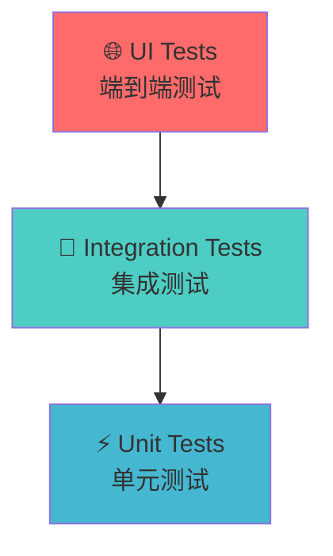

<style>
@keyframes fadeInUp {
  from {
    opacity: 0;
    transform: translateY(30px);
  }
  to {
    opacity: 1;
    transform: translateY(0);
  }
}

@keyframes slideInLeft {
  from {
    opacity: 0;
    transform: translateX(-50px);
  }
  to {
    opacity: 1;
    transform: translateX(0);
  }
}

@keyframes slideInRight {
  from {
    opacity: 0;
    transform: translateX(50px);
  }
  to {
    opacity: 1;
    transform: translateX(0);
  }
}

@keyframes bounce {
  0%, 20%, 50%, 80%, 100% {
    transform: translateY(0);
  }
  40% {
    transform: translateY(-10px);
  }
  60% {
    transform: translateY(-5px);
  }
}

@keyframes pulse {
  0% {
    transform: scale(1);
  }
  50% {
    transform: scale(1.05);
  }
  100% {
    transform: scale(1);
  }
}

@keyframes rotate {
  from {
    transform: rotate(0deg);
  }
  to {
    transform: rotate(360deg);
  }
}

@keyframes glow {
  0%, 100% {
    box-shadow: 0 0 5px rgba(59, 130, 246, 0.5);
  }
  50% {
    box-shadow: 0 0 20px rgba(59, 130, 246, 0.8);
  }
}

.animate-fade-in-up {
  animation: fadeInUp 0.6s ease-out;
}

.animate-slide-in-left {
  animation: slideInLeft 0.6s ease-out;
}

.animate-slide-in-right {
  animation: slideInRight 0.6s ease-out;
}

.animate-bounce {
  animation: bounce 1s ease-in-out;
}

.animate-pulse {
  animation: pulse 2s ease-in-out infinite;
}

.animate-rotate {
  animation: rotate 2s linear infinite;
}

.animate-glow {
  animation: glow 2s ease-in-out infinite;
}

.hover-scale:hover {
  transform: scale(1.05);
  transition: transform 0.3s ease;
}

.hover-glow:hover {
  box-shadow: 0 0 15px rgba(59, 130, 246, 0.6);
  transition: box-shadow 0.3s ease;
}

/* canvas-confetti 会自动创建 canvas 元素 */
</style>

# React + Vitest 单元测试实践

<div class="animate-fade-in-up">
从基础概念到实际应用的完整指南
</div>

<div class="pt-12 animate-fade-in-up" style="animation-delay: 0.3s;">
  <span @click="$slidev.nav.next" class="px-2 py-1 rounded cursor-pointer hover-scale hover-glow" hover="bg-white bg-opacity-10">
    开始学习之旅 <carbon:arrow-right class="inline animate-pulse"/>
  </span>
</div>

<div class="abs-br m-6 flex gap-2">
  <button @click="$slidev.nav.openInEditor()" title="Open in Editor" class="text-xl slidev-icon-btn opacity-50 !border-none !hover:text-white">
    <carbon:edit />
  </button>
  <a href="https://vitest.dev" target="_blank" alt="Vitest" title="Vitest"
    class="text-xl slidev-icon-btn opacity-50 !border-none !hover:text-white">
  </a>
</div>

---
transition: fade-out
---

# 课程大纲

<div class="grid grid-cols-2 gap-4 pt-4 -mb-6">

<div v-click class="flex items-center p-4 bg-blue-50 dark:bg-blue-900/20 rounded-lg hover-scale animate-slide-in-left">
  <div class="text-3xl mr-4 animate-bounce">🧪</div>
  <div>
    <h3 class="font-bold text-lg">第一部分：Unit Test 基础</h3>
    <p class="text-sm opacity-70">什么是单元测试？为什么需要单元测试？</p>
  </div>
</div>

<div v-click class="flex items-center p-4 bg-green-50 dark:bg-green-900/20 rounded-lg hover-scale animate-slide-in-right">
  <div class="text-3xl mr-4 animate-bounce">⚡</div>
  <div>
    <h3 class="font-bold text-lg">第二部分：Vitest 介绍</h3>
    <p class="text-sm opacity-70">现代化的测试框架，快速且强大</p>
  </div>
</div>

<div v-click class="flex items-center p-4 bg-purple-50 dark:bg-purple-900/20 rounded-lg hover-scale animate-slide-in-left">
  <div class="text-3xl mr-4 animate-bounce">💻</div>
  <div>
    <h3 class="font-bold text-lg">第三部分：实战演练</h3>
    <p class="text-sm opacity-70">从简单到复杂，循序渐进的实例</p>
  </div>
</div>

<div v-click class="flex items-center p-4 bg-orange-50 dark:bg-orange-900/20 rounded-lg hover-scale animate-slide-in-right">
  <div class="text-3xl mr-4 animate-bounce">🤖</div>
  <div>
    <h3 class="font-bold text-lg">第四部分：AI 辅助测试</h3>
    <p class="text-sm opacity-70">利用 AI 工具和 Cursor Rules 提升测试效率</p>
  </div>
</div>

</div>

---
layout: section
class: text-center
---

# 第一部分
## Unit Test 基础概念 <span class="animate-pulse">🧪</span>

---

# 什么是单元测试？

<div class="grid grid-cols-2 gap-8 pt-4">

<div class="animate-slide-in-left">

## 定义

<v-click>

**单元测试**是对软件中最小可测试单元进行验证的过程，在 React 中通常指对独立组件或函数的测试。

</v-click>

<v-click>

## 特点

- 🧪 **独立性** - 每个测试独立运行
- ⚡ **快速** - 执行速度快
- 🔄 **可重复** - 结果一致可靠
- 🤖 **自动化** - 可自动执行

</v-click>

</div>

<div v-click class="animate-slide-in-right">

## 测试金字塔



<div class="text-sm pt-2 opacity-70">
单元测试是测试金字塔的基础，数量最多，成本最低
</div>

</div>

</div>

---

# 为什么需要单元测试？

<div class="grid grid-cols-2 gap-8 pt-4">

<div>

## 🛡️ 质量保障

<v-click>

- 🐛 **及早发现bug** - 在开发阶段就发现问题
- 🔄 **回归测试** - 确保修改不会破坏现有功能
- ✨ **代码质量** - 促使编写更好的代码

</v-click>

<v-click>

## 📚 文档作用

- 📖 **活文档** - 测试即文档，展示代码如何使用
- 📋 **规格说明** - 明确功能的预期行为

</v-click>

</div>

<div>

## 🔧 开发效率

<v-click>

- 🔨 **重构信心** - 安全地重构代码
- ⚡ **快速反馈** - 立即知道代码是否正常工作
- 🔍 **调试辅助** - 帮助定位问题

</v-click>

</div>

</div>

---

# 单元测试的基本结构

## AAA 模式

<div class="grid grid-cols-3 gap-4 pt-4">

<div v-click class="p-4 bg-blue-50 dark:bg-blue-900/20 rounded-lg hover-scale animate-fade-in-up" style="animation-delay: 0.1s;">
<h3 class="font-bold text-center text-blue-600 dark:text-blue-400 animate-pulse">Arrange</h3>
<p class="text-sm text-center">准备阶段</p>
<ul class="text-xs mt-2">
  <li>• 准备测试数据</li>
  <li>• 设置测试环境</li>
  <li>• 创建测试对象</li>
</ul>
</div>

<div v-click class="p-4 bg-green-50 dark:bg-green-900/20 rounded-lg hover-scale animate-fade-in-up" style="animation-delay: 0.2s;">
<h3 class="font-bold text-center text-green-600 dark:text-green-400 animate-pulse">Act</h3>
<p class="text-sm text-center">执行阶段</p>
<ul class="text-xs mt-2">
  <li>• 调用被测试的方法</li>
  <li>• 触发要测试的行为</li>
  <li>• 获取执行结果</li>
</ul>
</div>

<div v-click class="p-4 bg-purple-50 dark:bg-purple-900/20 rounded-lg hover-scale animate-fade-in-up" style="animation-delay: 0.3s;">
<h3 class="font-bold text-center text-purple-600 dark:text-purple-400 animate-pulse">Assert</h3>
<p class="text-sm text-center">断言阶段</p>
<ul class="text-xs mt-2">
  <li>• 验证执行结果</li>
  <li>• 检查状态变化</li>
  <li>• 确认预期行为</li>
</ul>
</div>

</div>

<div v-click class="mt-6">

```javascript {class: "animate-fade-in-up hover-scale"}
test('should add two numbers correctly', () => {
  // Arrange - 准备测试数据
  const a = 2, b = 3;
  
  // Act - 执行被测试的功能
  const result = add(a, b);
  
  // Assert - 验证结果
  expect(result).toBe(5);
});
```

</div>

---
layout: section
class: text-center
---

# 第二部分
## Vitest 介绍 <span class="animate-pulse">⚡</span>

---

# 什么是 Vitest？

<div class="grid grid-cols-2 gap-8 pt-4">

<div class="animate-slide-in-left">

## 🚀 现代化测试框架

<v-click>

Vitest 是一个由 **Vite** 提供支持的极速单元测试框架

</v-click>

<v-click>

## 核心特性

- ⚡ **极速HMR** - 基于 Vite，开箱即用的 ESM、TypeScript 和 JSX 支持
- ⚙️ **零配置** - 智能默认配置，即装即用
- 🔄 **Jest 兼容** - 熟悉的 API，轻松迁移
- 🔍 **智能监听** - 只运行相关的测试
- 🖥️ **浏览器测试**：支持真实浏览器环境测试
</v-click>

</div>

<div v-click class="animate-slide-in-right">

## 与其他测试框架对比

| 特性 | Vitest | Jest | 
|------|---------|------|
| 启动速度 | ⚡ 极快 | 🐌 较慢 |
| ESM 支持 | ✅ 原生 | ⚠️ 实验性 |
| TypeScript | ✅ 零配置 | 🔧 需配置 |
| Watch 模式 | ⚡ 智能 | 🔄 基础 |
| 配置复杂度 | 📦 简单 | 🔧 复杂 |

</div>

</div>

---

# DOM 环境：happy-dom vs jsdom

<div class="grid grid-cols-2 gap-8 pt-8">

<div>

## 🚀 happy-dom 优势

<v-click>

- ⚡ **启动速度**: ~200ms vs ~800ms (快 3-4 倍) <span class="animate-pulse">🚀</span>
- 🏃 **内存占用**: ~75MB vs ~150MB (减少约 50%) <span class="animate-pulse">💾</span>
- 🌐 **现代 API**: 更好的 ES6+ 和现代 Web API 支持 <span class="animate-pulse">🌐</span>
- 🔧 **维护性**: 活跃开发，定期更新 <span class="animate-pulse">🔧</span>

</v-click>

<v-click>

</v-click>

</div>

<div>

## 🔄 迁移简单

<v-click>

```typescript {class: "animate-fade-in-up"}
// 只需更改一行配置
export default defineConfig({
  test: {
-   environment: 'jsdom',
+   environment: 'happy-dom',
    globals: true,
  }
})
```

<div class="text-sm pt-1 opacity-70">
所有现有测试代码无需修改，完全兼容！
</div>

</v-click>

</div>

</div>

---

# Vitest 的优势

<div class="grid grid-cols-2 gap-8 pt-4">

<div>

## 🎯 开发体验

<v-click>

- 🔄 **热重载** - 文件变化时自动重新运行测试
- ⚡ **并行执行** - 充分利用多核 CPU
- 🚨 **错误提示** - 清晰的错误信息和堆栈跟踪
- 🛠️ **调试友好** - 与 IDE 完美集成

</v-click>

<v-click>

## 📦 生态系统

- ⚡ **Vite 集成** - 共享配置和插件
- ⚛️ **Vue/React 支持** - 开箱即用的组件测试
- 🔌 **丰富插件** - 活跃的插件生态系统

</v-click>

</div>

<div>

<v-click>

## 🔧 配置简单

```typescript
// vitest.config.ts
export default defineConfig({
  test: {
    environment: 'happy-dom', // 浏览器环境
    globals: true,        // 全局测试 API
  }
})
```

</v-click>

</div>

</div>

---

# Vitest 基本 API

<div class="grid grid-cols-2 gap-8 pt-4">

<div>

## 测试函数

<v-click>

```javascript
// 基本测试
test('basic test', () => {
  expect(1 + 1).toBe(2);
});

// 描述块
describe('Calculator', () => {
  test('should add', () => {
    expect(add(2, 3)).toBe(5);
  });
});
```

</v-click>

<v-click>

## 生命周期钩子

```javascript
describe('User Service', () => {
  beforeEach(() => {
    // 每个测试前执行
  });
  
  afterEach(() => {
    // 每个测试后执行
  });
});
```

</v-click>

</div>

<div>

## 断言方法

<v-click>

```javascript
// 基本断言
expect(value).toBe(expected);
expect(value).toEqual(expected);
expect(value).toBeTruthy();
expect(value).toBeFalsy();

// 数组和对象
expect(array).toContain(item);
expect(object).toHaveProperty('key');

// 异常测试
expect(() => {
  throw new Error('error');
}).toThrow('error');
```

</v-click>

<v-click>

## 异步测试

```javascript
// Promise
test('async test', async () => {
  const result = await fetchData();
  expect(result).toBe('data');
});
```

</v-click>

</div>

</div>

---

# Vi Mock 的使用

<div class="grid grid-cols-2 gap-8 pt-4">

<div>

## 🎭 Mock 的作用

<v-click>

- 🧪 **隔离测试** - 避免外部依赖影响测试结果 <span class="animate-pulse">🔒</span>
- 🎪 **控制行为** - 模拟函数返回值和异常情况 <span class="animate-pulse">🎪</span>
- ✅ **验证调用** - 检查函数是否被正确调用 <span class="animate-pulse">✅</span>
- ⚡ **提高速度** - 避免真实的网络请求和数据库操作 <span class="animate-pulse">⚡</span>

</v-click>

<v-click>

## 🔧 基本用法

```javascript
import { vi } from 'vitest';

// 创建 mock 函数
const mockFn = vi.fn();

// 设置返回值
mockFn.mockReturnValue('mocked value');

// 设置实现
mockFn.mockImplementation(() => 'custom logic');
```

</v-click>

</div>

<div>

## 📝 常用 Mock 方法

<v-click>

```javascript
// 函数调用验证
expect(mockFn).toHaveBeenCalled();
expect(mockFn).toHaveBeenCalledWith('arg1', 'arg2');
expect(mockFn).toHaveBeenCalledTimes(3);

// 返回值验证
expect(mockFn).toHaveReturnedWith('expected value');

// 清除 mock
vi.clearAllMocks();
vi.resetAllMocks();
```

</v-click>

<v-click>

## 🌐 模块 Mock

```javascript
// Mock 整个模块
vi.mock('./api', () => ({
  fetchUser: vi.fn(),
  saveUser: vi.fn()
}));

// Mock 部分模块
vi.mock('./utils', async () => {
  const actual = await vi.importActual('./utils');
  return {
    ...actual,
    expensiveFunction: vi.fn()
  };
});
```

</v-click>

</div>

</div>

---
layout: section
class: text-center
---

# 第三部分
## 实战演练：从简单到复杂 <span class="animate-pulse">💻</span>

---

# 环境准备

## ⚙️ 安装和配置

<div class="grid grid-cols-2 gap-8 pt-4">

<div>

## 📦 安装依赖

<v-click>

```bash
# 安装 Vitest 和相关依赖
npm install -D vitest @vitest/ui

# React 测试工具
npm install -D @testing-library/react @testing-library/jest-dom happy-dom
```

</v-click>

## ⚙️ 配置文件

<v-click>

```typescript
// vitest.config.ts
import { defineConfig } from 'vitest/config'

export default defineConfig({
  test: {
    environment: 'happy-dom',
    globals: true,
    setupFiles: './src/test/setup.ts'
  }
})
```

</v-click>

</div>

<div>

## 🔧 测试环境设置

<v-click>

```typescript
// src/test/setup.ts
import '@testing-library/jest-dom'
```

</v-click>

<v-click>

## 📝 Package.json 脚本

```json
{
  "scripts": {
    "test": "vitest",
    "test:ui": "vitest --ui",
    "test:coverage": "vitest --coverage"
  }
}
```

</v-click>

<v-click>

## 🚀 运行测试

```bash
npm test        # 运行测试
npm run test:ui # 可视化界面
```

</v-click>

</div>

</div>

---

# 示例1：基本测试使用

## 🧮 测试简单的数学函数

<div class="grid grid-cols-2 gap-4 pt-4">

<div>

**被测试的函数**

```typescript
// src/utils/math.ts
export const add = (a: number, b: number): number => {
  return a + b;
};

export const multiply = (a: number, b: number): number => {
  return a * b;
};

export const divide = (a: number, b: number): number => {
  if (b === 0) {
    throw new Error('Division by zero');
  }
  return a / b;
};
```

</div>

<div>

**测试代码**

```typescript
// src/utils/__tests__/math.test.ts
import { describe, test, expect } from 'vitest'
import { add, multiply, divide } from '../math'

describe('Math Functions', () => {
  test('should add two numbers correctly', () => {
    expect(add(2, 3)).toBe(5);
    expect(add(-1, 1)).toBe(0);
    expect(add(0, 0)).toBe(0);
  });

  test('should multiply two numbers correctly', () => {
    expect(multiply(2, 3)).toBe(6);
    expect(multiply(-2, 3)).toBe(-6);
    expect(multiply(0, 5)).toBe(0);
  });

  test('should divide two numbers correctly', () => {
    expect(divide(6, 2)).toBe(3);
    expect(divide(5, 2)).toBe(2.5);
    expect(divide(-6, 2)).toBe(-3);
  });

  test('should throw error when dividing by zero', () => {
    expect(() => divide(5, 0)).toThrow('Division by zero');
  });
});
```

</div>

</div>

---

# 示例2：测试自定义Hook

## 🪝 复杂业务逻辑测试

<div class="grid grid-cols-2 gap-4 pt-4">

<div>

**自定义Hook**

```tsx
// src/hooks/useCounter.ts
import { useState, useCallback } from 'react';

export interface UseCounterReturn {
  count: number;
  increment: () => void;
  decrement: () => void;
  reset: () => void;
  setCount: (value: number) => void;
}

export const useCounter = (
  initialValue: number = 0
): UseCounterReturn => {
  const [count, setCount] = useState(initialValue);

  const increment = useCallback(() => {
    setCount(prev => prev + 1);
  }, []);

  const decrement = useCallback(() => {
    setCount(prev => prev - 1);
  }, []);

  const reset = useCallback(() => {
    setCount(initialValue);
  }, [initialValue]);

  return {
    count,
    increment,
    decrement,
    reset,
    setCount
  };
};
```

</div>

<div>

**Hook 测试**

```tsx
// src/hooks/__tests__/useCounter.test.ts
import { describe, test, expect } from 'vitest'
import { renderHook, act } from '@testing-library/react'
import { useCounter } from '../useCounter'

describe('useCounter Hook', () => {
  test('initializes with default value', () => {
    const { result } = renderHook(() => useCounter());
    
    expect(result.current.count).toBe(0);
  });

  test('initializes with custom value', () => {
    const { result } = renderHook(() => useCounter(10));
    
    expect(result.current.count).toBe(10);
  });

  test('increments count', () => {
    const { result } = renderHook(() => useCounter(0));
    
    act(() => {
      result.current.increment();
    });
    
    expect(result.current.count).toBe(1);
  });

  test('decrements count', () => {
    const { result } = renderHook(() => useCounter(5));
    
    act(() => {
      result.current.decrement();
    });
    
    expect(result.current.count).toBe(4);
  });

  test('resets to initial value', () => {
    const { result } = renderHook(() => useCounter(3));
    
    act(() => {
      result.current.increment();
      result.current.increment();
    });
    
    expect(result.current.count).toBe(5);
    
    act(() => {
      result.current.reset();
    });
    
    expect(result.current.count).toBe(3);
  });
});
```

</div>

</div>

---

# 示例3：Mock 异步函数和 API 调用

## 🌐 测试包含外部依赖的组件

<div class="grid grid-cols-2 gap-4 pt-4">

<div>

**用户服务组件**

```tsx
// src/components/UserProfile.tsx
import { useState, useEffect } from 'react';
import { fetchUserData, saveUserData } from '../services/api';

interface User {
  id: string;
  name: string;
  email: string;
}

export const UserProfile: React.FC = () => {
  const [user, setUser] = useState<User | null>(null);
  const [loading, setLoading] = useState(true);
  const [error, setError] = useState<string | null>(null);

  useEffect(() => {
    const loadUser = async () => {
      try {
        const userData = await fetchUserData();
        setUser(userData);
      } catch (err) {
        setError(err instanceof Error ? err.message : '加载失败');
      } finally {
        setLoading(false);
      }
    };
    
    loadUser();
  }, []);

  const handleSave = async (updatedUser: User) => {
    try {
      await saveUserData(updatedUser);
      setUser(updatedUser);
    } catch (err) {
      setError(err instanceof Error ? err.message : '保存失败');
    }
  };

  if (loading) return <div>加载中...</div>;
  if (error) return <div>错误: {error}</div>;
  if (!user) return <div>用户不存在</div>;

  return (
    <div>
      <h2>{user.name}</h2>
      <p>{user.email}</p>
      <button onClick={() => handleSave({...user, name: '新名字'})}>
        更新用户
      </button>
    </div>
  );
};
```

</div>

<div>

**Mock API 的测试**

```tsx
// src/components/__tests__/UserProfile.test.tsx
import { describe, test, expect, vi, beforeEach } from 'vitest';
import { render, screen, waitFor } from '@testing-library/react';
import userEvent from '@testing-library/user-event';
import { UserProfile } from '../UserProfile';

// 🌐 Mock 整个 API 模块
vi.mock('../services/api', () => ({
  fetchUserData: vi.fn(),
  saveUserData: vi.fn()
}));

// 导入 mock 的函数
import { fetchUserData, saveUserData } from '../services/api';

describe('UserProfile Component', () => {
  beforeEach(() => {
    // 🔄 每个测试前重置 mock
    vi.clearAllMocks();
  });

  test('displays user data when API call succeeds', async () => {
    // 🎭 设置 mock 返回值
    const mockUser = { id: '1', name: '张三', email: 'zhang@example.com' };
    vi.mocked(fetchUserData).mockResolvedValue(mockUser);

    render(<UserProfile />);

    // 等待异步操作完成
    await waitFor(() => {
      expect(screen.getByText('张三')).toBeInTheDocument();
    });

    expect(screen.getByText('zhang@example.com')).toBeInTheDocument();
  });

  test('displays error when API call fails', async () => {
    // 🎭 模拟 API 错误
    vi.mocked(fetchUserData).mockRejectedValue(new Error('网络错误'));

    render(<UserProfile />);

    await waitFor(() => {
      expect(screen.getByText('错误: 网络错误')).toBeInTheDocument();
    });
  });

  test('calls saveUserData when update button is clicked', async () => {
    const mockUser = { id: '1', name: '张三', email: 'zhang@example.com' };
    vi.mocked(fetchUserData).mockResolvedValue(mockUser);
    vi.mocked(saveUserData).mockResolvedValue(undefined);

    const user = userEvent.setup();
    render(<UserProfile />);

    await waitFor(() => {
      expect(screen.getByText('张三')).toBeInTheDocument();
    });

    await user.click(screen.getByText('更新用户'));

    // ✅ 验证 saveUserData 被调用
    expect(saveUserData).toHaveBeenCalledWith({
      id: '1',
      name: '新名字',
      email: 'zhang@example.com'
    });
  });

  test('handles save error correctly', async () => {
    const mockUser = { id: '1', name: '张三', email: 'zhang@example.com' };
    vi.mocked(fetchUserData).mockResolvedValue(mockUser);
    vi.mocked(saveUserData).mockRejectedValue(new Error('保存失败'));

    const user = userEvent.setup();
    render(<UserProfile />);

    await waitFor(() => {
      expect(screen.getByText('张三')).toBeInTheDocument();
    });

    await user.click(screen.getByText('更新用户'));

    await waitFor(() => {
      expect(screen.getByText('错误: 保存失败')).toBeInTheDocument();
    });
  });
});
```

</div>

</div>

---

# 示例4：完整 Todo 应用测试

## 📋 测试整个应用的用户流程

<div class="grid grid-cols-2 gap-4 pt-4">

<div>

**完整的 Todo 应用**

```tsx
// src/components/TodoApp.tsx
export const TodoApp: React.FC = () => {
  const [todos, setTodos] = useState<Todo[]>([]);
  const [filter, setFilter] = useState<'all' | 'active' | 'completed'>('all');

  const addTodo = useCallback((text: string) => {
    const newTodo: Todo = {
      id: Date.now().toString(),
      text,
      completed: false
    };
    setTodos(prev => [...prev, newTodo]);
  }, []);

  const toggleTodo = useCallback((id: string) => {
    setTodos(prev => 
      prev.map(todo => 
        todo.id === id 
          ? { ...todo, completed: !todo.completed }
          : todo
      )
    );
  }, []);

  const deleteTodo = useCallback((id: string) => {
    setTodos(prev => prev.filter(todo => todo.id !== id));
  }, []);

  const clearCompleted = useCallback(() => {
    setTodos(prev => prev.filter(todo => !todo.completed));
  }, []);

  return (
    <div className="max-w-md mx-auto p-6 bg-gray-50">
      <h1 className="text-2xl font-bold text-center mb-6">
        📝 Todo 应用
      </h1>
      
      <TodoInput onAdd={addTodo} />
      
      <TodoList
        todos={todos}
        onToggle={toggleTodo}
        onDelete={deleteTodo}
        filter={filter}
      />
      
      {todos.length > 0 && (
        <div className="mt-6 pt-4 border-t">
          <div className="flex items-center justify-between">
            <span>{activeCount} 项待完成</span>
            
            <div className="flex gap-2">
              <button onClick={() => setFilter('all')}>全部</button>
              <button onClick={() => setFilter('active')}>进行中</button>
              <button onClick={() => setFilter('completed')}>已完成</button>
            </div>
            
            {completedCount > 0 && (
              <button onClick={clearCompleted}>清除已完成</button>
            )}
          </div>
        </div>
      )}
    </div>
  );
};
```

</div>

<div>

**集成测试（包含 Vi Mock 使用）**

```tsx
// src/components/__tests__/TodoApp.test.tsx
import { describe, test, expect, vi } from 'vitest'
import { render, screen } from '@testing-library/react'
import userEvent from '@testing-library/user-event'
import { TodoApp } from '../TodoApp'

describe('TodoApp Integration Tests', () => {
  test('adds new todo when form is submitted', async () => {
    const user = userEvent.setup();
    render(<TodoApp />);
    
    const input = screen.getByPlaceholderText('What needs to be done?');
    
    await user.type(input, '学习 Vitest');
    await user.keyboard('{Enter}');
    
    expect(screen.getByText('学习 Vitest')).toBeInTheDocument();
    expect(input).toHaveValue('');
  });

  test('toggles todo completion status', async () => {
    const user = userEvent.setup();
    render(<TodoApp />);
    
    // Add a todo
    const input = screen.getByPlaceholderText('What needs to be done?');
    await user.type(input, '学习 Vitest');
    await user.keyboard('{Enter}');
    
    // Toggle completion
    const checkbox = screen.getByRole('checkbox');
    await user.click(checkbox);
    
    expect(checkbox).toBeChecked();
  });

  test('filters todos correctly', async () => {
    const user = userEvent.setup();
    render(<TodoApp />);
    
    // Add multiple todos
    const input = screen.getByPlaceholderText('What needs to be done?');
    await user.type(input, '学习 Vitest');
    await user.keyboard('{Enter}');
    
    await user.type(input, '学习 React');
    await user.keyboard('{Enter}');
    
    // Complete one todo
    const checkboxes = screen.getAllByRole('checkbox');
    await user.click(checkboxes[1]); // Complete "学习 React"
    
    // Test active filter
    await user.click(screen.getByText('进行中'));
    expect(screen.getByText('学习 Vitest')).toBeInTheDocument();
    expect(screen.queryByText('学习 React')).not.toBeInTheDocument();
    
    // Test completed filter
    await user.click(screen.getByText('已完成'));
    expect(screen.getByText('学习 React')).toBeInTheDocument();
    expect(screen.queryByText('学习 Vitest')).not.toBeInTheDocument();
  });

  test('clears completed todos', async () => {
    const user = userEvent.setup();
    render(<TodoApp />);
    
    // Add and complete todos
    const input = screen.getByPlaceholderText('What needs to be done?');
    await user.type(input, '学习 Vitest');
    await user.keyboard('{Enter}');
    
    await user.type(input, '学习 React');
    await user.keyboard('{Enter}');
    
    // Complete both todos
    const checkboxes = screen.getAllByRole('checkbox');
    await user.click(checkboxes[0]);
    await user.click(checkboxes[1]);
    
    // Clear completed
    await user.click(screen.getByText('清除已完成'));
    
    expect(screen.queryByText('学习 Vitest')).not.toBeInTheDocument();
    expect(screen.queryByText('学习 React')).not.toBeInTheDocument();
  });
});
```

</div>

</div>

---
layout: section
class: text-center
---

# 第四部分
## AI 辅助单元测试 <span class="animate-pulse">🤖</span>

---

# AI 辅助测试的优势

<div class="grid grid-cols-2 gap-8 pt-4">

<div>

## 🤖 AI 的优势

<v-click>

- ⚡ **快速生成** - 几秒钟生成完整的测试用例 <span class="animate-pulse">⚡</span>
- 🎯 **覆盖全面** - 自动考虑边界条件和异常情况 <span class="animate-pulse">🎯</span>
- ✨ **代码质量** - 遵循最佳实践和测试模式 <span class="animate-pulse">✨</span>
- 📚 **学习辅助** - 通过 AI 生成的测试学习测试技巧 <span class="animate-pulse">📚</span>

</v-click>

<v-click>

## 🎯 适用场景

- 🆕 **新功能开发** - 为新组件快速生成测试
- 🔄 **重构代码** - 为重构后的代码生成测试
- 📖 **学习测试** - 学习如何为特定功能编写测试
- ⚡ **提高效率** - 减少重复性测试编写工作

</v-click>

</div>

<div>

## ⚠️ 注意事项

<v-click>

- 👀 **需要审查** - AI 生成的测试需要人工审查和调整
- 🧠 **理解代码** - AI 可能不完全理解业务逻辑
- ✅ **测试质量** - 确保测试真正验证了功能
- 🔧 **维护成本** - 生成的测试也需要维护

</v-click>

<v-click>

## 🔧 最佳实践

```javascript
// 1. 提供清晰的代码上下文
// 2. 明确测试目标和边界条件
// 3. 审查和调整生成的测试
// 4. 确保测试覆盖关键路径
// 5. 利用 Cursor Rules 提升测试质量
```

</v-click>

</div>

</div>

---
layout: center
class: text-center
---

# 总结

<div class="grid grid-cols-3 gap-8 pt-8">

<div v-click class="p-6 bg-blue-50 dark:bg-blue-900/20 rounded-lg hover-scale animate-fade-in-up" style="animation-delay: 0.1s;">
  <div class="text-4xl mb-4 animate-bounce">🎯</div>
  <h3 class="font-bold text-lg mb-2">单元测试的价值</h3>
  <p class="text-sm opacity-70">提高代码质量，降低维护成本，增强开发信心</p>
</div>

<div v-click class="p-6 bg-green-50 dark:bg-green-900/20 rounded-lg hover-scale animate-fade-in-up" style="animation-delay: 0.2s;">
  <div class="text-4xl mb-4 animate-bounce">⚡</div>
  <h3 class="font-bold text-lg mb-2">Vitest 的优势</h3>
  <p class="text-sm opacity-70">现代化、高性能、零配置的测试框架</p>
</div>

<div v-click class="p-6 bg-purple-50 dark:bg-purple-900/20 rounded-lg hover-scale animate-fade-in-up" style="animation-delay: 0.3s;">
  <div class="text-4xl mb-4 animate-bounce">🚀</div>
  <h3 class="font-bold text-lg mb-2">实践是关键</h3>
  <p class="text-sm opacity-70">从简单到复杂，逐步掌握测试技能</p>
</div>

</div>

<div v-click class="pt-12">

## 下一步行动

- ⚡ 在项目中引入 Vitest
- 📝 为核心功能编写测试
- 📊 设定覆盖率目标
- 🔄 建立测试驱动开发流程
- 📚 storybook + vitest browser test

</div>

---
layout: center
class: text-center
---

# 谢谢大家！

<div class="pt-12 animate-fade-in-up">
  <span class="text-6xl animate-bounce">🎉</span>
</div>

<!-- 使用 Slidev 支持的脚本方式 -->
<script setup>
import { onMounted } from 'vue'

onMounted(() => {
  // 动态加载canvas-confetti
  const script = document.createElement('script')
  script.src = 'https://cdn.jsdelivr.net/npm/canvas-confetti@1.9.3/dist/confetti.browser.min.js'
  script.onload = function() {
    const confetti = window.confetti
    
    // 基础撒花效果
    function fireConfetti() {
      console.log('🎉 开始撒花！')
      
      const colors = ['#ff6b6b', '#4ecdc4', '#45b7d1', '#96ceb4', '#feca57', '#ff9ff3', '#54a0ff', '#5f27cd', '#00d2d3', '#ff9f43', '#10ac84', '#2ed573', '#1e90ff', '#ffa502', '#ff6348', '#a55eea', '#26de81', '#fd79a8', '#ff4757', '#00d2d3'];
      
      // 主发射
      confetti({
        particleCount: 100,
        spread: 80,
        origin: { y: 0.5, x: 0.5 },
        colors: colors,
        shapes: ['circle', 'square'],
        gravity: -0.4,
        ticks: 600,
        startVelocity: 60,
        decay: 0.98,
        angle: 90,
        drift: 0
      });
      
      // 延迟发射，创造连续效果
      setTimeout(() => {
        confetti({
          particleCount: 50,
          spread: 60,
          origin: { y: 0.4, x: 0.5 },
          colors: colors.slice(0, 10),
          shapes: ['circle'],
          gravity: -0.3,
          ticks: 500,
          startVelocity: 50,
          decay: 0.97,
          angle: 90
        });
      }, 200);
      
      setTimeout(() => {
        confetti({
          particleCount: 50,
          spread: 60,
          origin: { y: 0.6, x: 0.5 },
          colors: colors.slice(10),
          shapes: ['square'],
          gravity: -0.3,
          ticks: 500,
          startVelocity: 50,
          decay: 0.97,
          angle: 90
        });
      }, 400);
    }
    
    // 全局变量，避免重复撒花
    let confettiInterval = null;
    let isConfettiActive = false;
    
    // 检查当前是否在最后一页
    function checkIfLastSlide() {
      // 检查URL是否包含"22"
      const currentUrl = window.location.href;
      
      console.log('当前URL:', currentUrl)
      
      // 检查URL是否包含"22"
      const isLastPage = currentUrl.includes('22');
      
      if (isLastPage && !isConfettiActive) {
        console.log('✅ 检测到第22页，开始撒花！')
        isConfettiActive = true;
        
        // 立即开始撒花
        fireConfetti();
        
        // 每3秒重复一次撒花效果
        confettiInterval = setInterval(fireConfetti, 3000);
      } else if (!isLastPage && isConfettiActive) {
        console.log('❌ 离开第22页，停止撒花！')
        isConfettiActive = false;
        
        // 清除定时器
        if (confettiInterval) {
          clearInterval(confettiInterval);
          confettiInterval = null;
        }
      }
    }
    
    // 页面加载完成后检查
    checkIfLastSlide();
    
    // 监听页面变化（Slidev 页面切换）
    const observer = new MutationObserver(() => {
      checkIfLastSlide();
    });
    
    observer.observe(document.body, {
      childList: true,
      subtree: true
    });
  }
  document.head.appendChild(script)
})
</script>

<div class="pt-8 animate-fade-in-up" style="animation-delay: 0.3s;">

## 继续学习资源

- 📚 [Vitest 官方文档](https://vitest.dev)
- 🧪 [Testing Library 文档](https://testing-library.com)
- 💡 [测试最佳实践](https://github.com/goldbergyoni/javascript-testing-best-practices)

</div>

<div class="pt-8 opacity-50 animate-fade-in-up" style="animation-delay: 0.6s;">
<carbon:logo-github class="animate-rotate" /> <a href="https://github.com/lynzz/vitest-demo" class="hover-glow">https://github.com/lynzz/vitest-demo</a>
</div>
